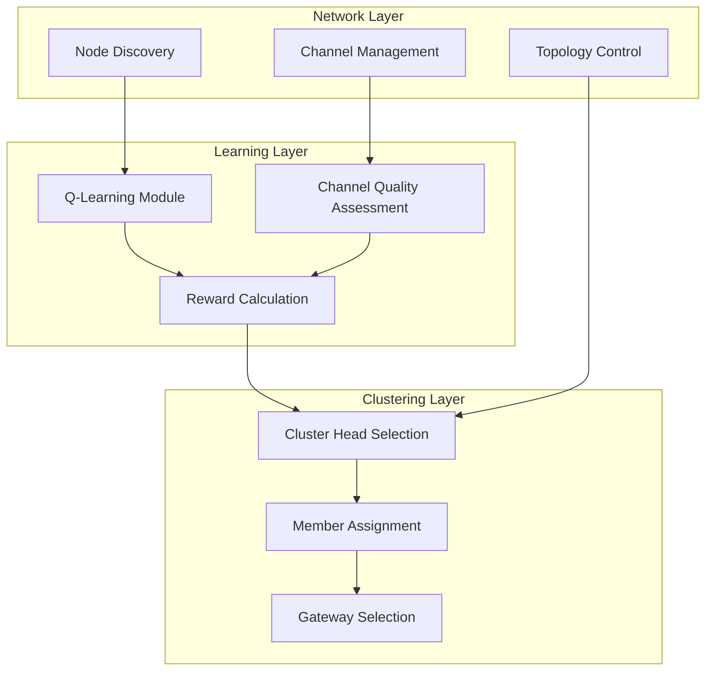
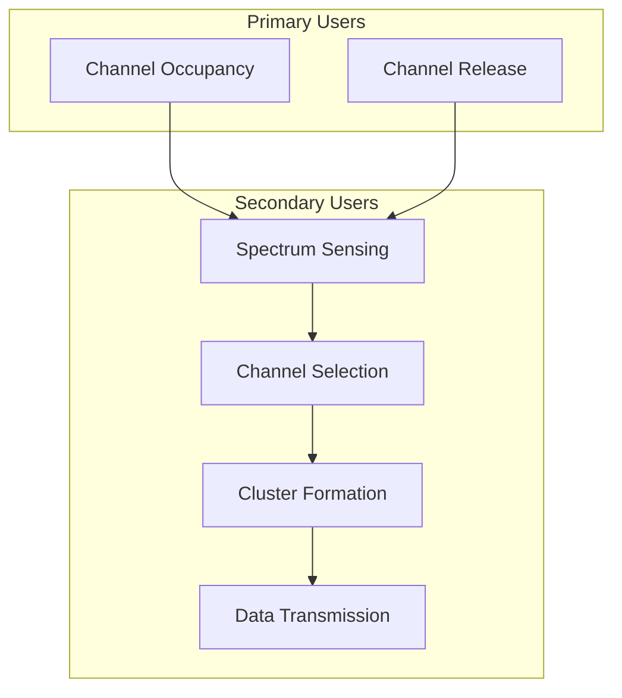
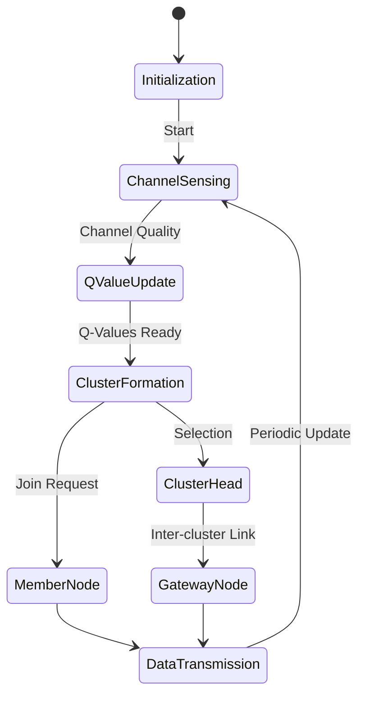
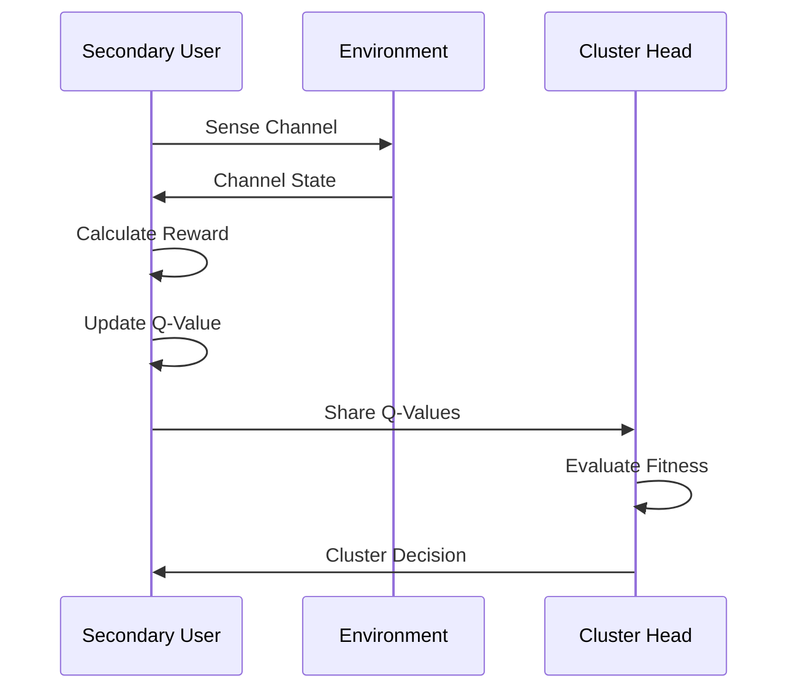
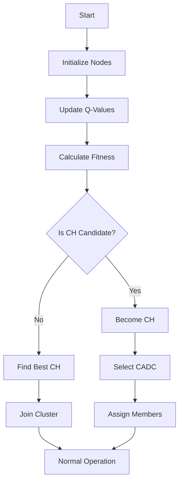
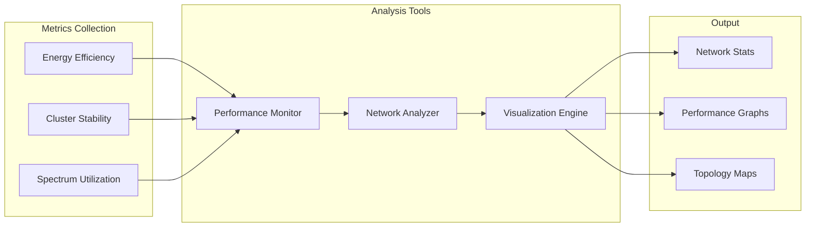

# Q-Learning Based Cognitive Radio Network Simulator

[](https://www.python.org/downloads/)
[](https://opensource.org/licenses/MIT)
[](https://www.dropbox.com/scl/fi/vo5x3hons46fywgq0ieih/08932525.pdf?rlkey=g52l6mb038100vug5x826hsih&e=1&dl=0)

This repository imitates a simple version of the Q-learning based clustering algorithm for Cognitive Radio Ad Hoc Networks (CRAHN) as described in the paper "Q-Learning Based Multi-Objective Clustering Algorithm for Cognitive Radio Ad Hoc Networks" (IEEE Access, 2019).

## 📖 Overview

### System Architecture



### Use Case Scenarios



### Node State Machine



### Q-Learning Process



### Clustering Algorithm Flow



Cognitive Radio Networks (CRN) allow secondary users (SUs) to opportunistically access licensed spectrum bands when primary users (PUs) are inactive. This implementation focuses on:

- Q-learning based channel quality evaluation
- Multi-objective cluster formation
- Dynamic spectrum allocation
- Energy-efficient network organization


## 🎯 Key Features

- **Q-Learning Based Channel Evaluation**: Dynamic channel quality assessment using reinforcement learning
- **Multi-Objective Clustering**: 
  - Residual energy optimization
  - Channel quality maximization
  - Network connectivity enhancement
- **Distributed Architecture**: No central control, fully autonomous nodes
- **Performance Metrics**: 
  - 30% improved network lifetime
  - 35% better energy efficiency
  - Enhanced spectrum utilization

## 🚀 Getting Started


1. Clone the repository:
```bash
git clone https://github.com/armanruet/Q-CRAHN.git
```

1. Install dependencies:
```bash
cd Q-CRAHN
pip install -r requirements.txt
```


### Quick Start

```python
from crahn.simulator import CRAHNSimulation

# Initialize simulation
sim = CRAHNSimulation(
    area_size=100,
    n_nodes=40,
    n_pus=12,
    n_channels=12
)

# Run simulation
metrics = sim.run_simulation(n_iterations=100)

# Visualize results
sim.visualize_network()
```

## 🗂️ Repository Structure

```
├── crahn/
│   ├── __init__.py
│   ├── simulator.py
│   ├── node.py
│   └── utils.py
├── requirements.txt
└── README.md
```

## 📝 Citation

If you use this code in your research, please cite:

```bibtex
@article{hossen2019qlearning,
  title={Q-Learning Based Multi-Objective Clustering Algorithm for Cognitive Radio Ad Hoc Networks},
  author={Hossen, Md Arman and Yoo, Sang-Jo},
  journal={IEEE Access},
  volume={7},
  pages={181959--181971},
  year={2019},
  publisher={IEEE}
}
```

## 🔬 Experimental Results

### Performance Analysis Architecture



### Network Performance Metrics

```mermaid
gantt
    title Network Performance Timeline
    dateFormat X
    axisFormat %L
    
    section Energy
    CH Energy     :e1, 0, 100
    Member Energy :e2, 0, 80
    
    section Clustering
    Formation     :c1, 0, 20
    Stabilization :c2, 20, 60
    Operation     :c3, 60, 100
    
    section Spectrum
    Sensing      :s1, 0, 30
    Allocation   :s2, 30, 70
    Optimization :s3, 70, 100
```



### Cluster Formation
The simulation demonstrates effective cluster formation with the following characteristics:

- **Cluster Size**: Adaptive based on network conditions
- **Energy Distribution**: Balanced load across clusters
- **Spectrum Utilization**: Efficient channel assignment


## 🛠️ Implementation Details

### Q-Learning Parameters
- Learning Rate (α): 0.1
- Discount Factor (γ): 0.9
- ε-greedy Exploration: 0.1

### Network Parameters
- Area Size: 100m × 100m
- Number of Nodes: 40
- Number of Channels: 12
- Primary Users: 12
- Transmission Range: 30m

## 🤝 Contributing

1. Fork the repository
2. Create your feature branch (`git checkout -b feature/AmazingFeature`)
3. Commit your changes (`git commit -m 'Add some AmazingFeature'`)
4. Push to the branch (`git push origin feature/AmazingFeature`)
5. Open a Pull Request

## 📄 License

This project is licensed under the MIT License - see the [LICENSE](LICENSE) file for details.

## 📞 Contact

For any queries or suggestions, please reach out to:
- Email: armanruet@gmail.com
- LinkedIn: [armanruet](https://www.linkedin.com/in/armanruet/)

---
Made with ❤️ by [Arman](https://armanruet.github.io/)